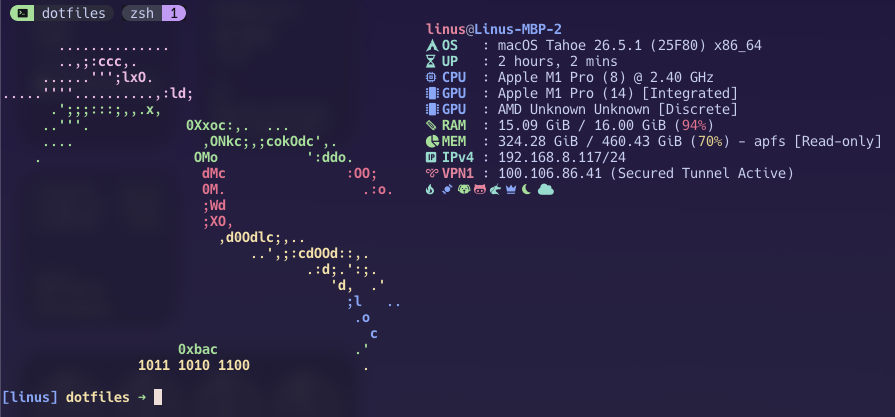

# My Personalized 💻 Dotfiles

This repository hosts my personal working & development environment
configuration for macOS. It is built around **Zsh**, **Neovim**, and
**Ghostty**, using **Zinit** to manage plugins efficiently.



## 🛠 Tooling & Stack

I use a variety of modern CLI tools and applications to enhance my workflow. You
can find the full list of tools, descriptions, and examples in:

👉 **[Detailed Tooling & Stack Guide](./docs/tools.md)**

## 🚀 Installation

### 1. Prerequisites

Ensure you have [Homebrew](https://brew.sh/) and `git` installed:

```bash
/bin/bash -c "$(curl -fsSL https://raw.githubusercontent.com/Homebrew/install/HEAD/install.sh)"
```

### 2. Setup Dotfiles

The setup should be handle by the `stow_script`. Ensure that you backup your
configuration before.

```bash
# 1. Clone repository
git clone https://github.com/LinusB/dotfiles.git ~/dotfiles

# 2. go into it
cd ~/dotfiles
```

This repository includes a `Brewfile` that lists all my formulae, casks, and VS
Code extensions. To install everything at once, run:

```bash
# Install all dependencies from the Brewfile
brew bundle install
```

The last step is to run the stow script to get the config synced via simlinks to
all the config locations.

```bash
# run stow script
chmod +x stow_script.sh
./stow_script.sh
```

## ⌨️ Keybindings & Aliases

### Shell Aliases

I use these aliases to map standard commands to their modern equivalents:

| Alias       | Command            | Description                         |
| :---------- | :----------------- | :---------------------------------- |
| `cat`       | `bat`              | Syntax highlighted file reading     |
| `df`        | `duf`              | Visual disk usage                   |
| `man`       | `tldr`             | Simplified man pages                |
| `ls`        | `ls --color`       | Colored directory listing           |
| `update`    | `topgrade`         | Updates system, brew, plugins, etc. |
| `v` / `vim` | `nvim`             | Opens Neovim                        |
| `cd`        | `z`                | Smart directory jumping             |
| `f`         | `fzf --preview...` | File fuzzy finder with preview      |

### Zsh Keybinds

| Key          | Action                                 |
| :----------- | :------------------------------------- |
| `Ctrl` + `f` | **Accept Autosuggestion** (Ghost text) |
| `Ctrl` + `k` | History Search Up                      |
| `Ctrl` + `j` | History Search Down                    |

## 📂 Structure

The repository is organized into packages for **GNU Stow**:

```
~/dotfiles/
├── stow_script.sh           # Stow automation script
├── zsh/                 # Shell configuration
│   └── .zshrc
├── nvim/                # Neovim config (stowed to ~/.config/nvim)
├── starship/            # Prompt config (stowed to ~/.config/starship)
├── ghostty/             # Terminal config (stowed to ~/.config/ghostty)
└── ...                  # Other packages (atuin, neofetch, etc.)
```

## ⚙️ Configuration Notes

- **Environment Variables**: I use a `.env` file in `$HOME` for sensitive
  tokens. The `.zshrc` automatically loads this.

- **Java**: `JAVA_HOME` is set to OpenJDK 17 via Homebrew.
